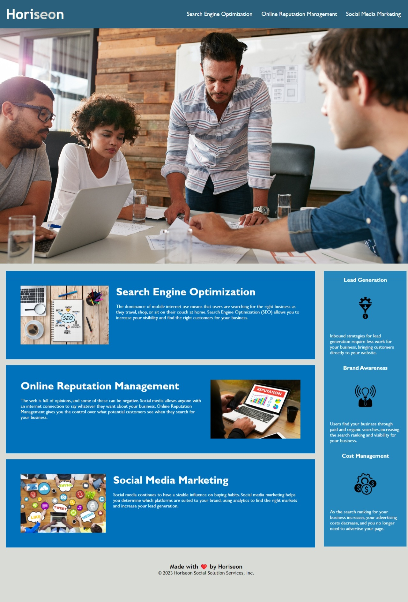

# Module 1 Challenge
*University of Minnesota - Coding Boot Camp*

## Description

Refactoring client's codebase following accessibility standards to be optimized for search engines.

- Refactored codebase to use semanitic HTML element tags
- Re-organized HTML elements to folow a logical structure independent of styling and postioning
- Application's CSS selectors and properties are consolidated and organized to follow semantic structure
- Added a descriptive title
- Added accessible 'alt' attributes to images

## Installation

N/A

## Usage

https://nestibry.github.io/umn-cbc-module-01-challenge/

## Credits

© 2023 edX Boot Camps LLC.

## License

[MIT License](https://choosealicense.com/licenses/mit/)

